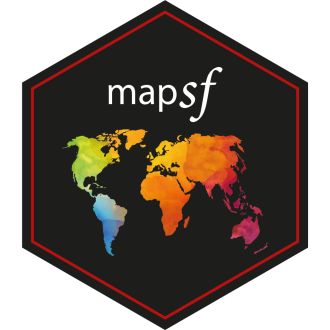

# Créer des cartes reproductibles avec `mapsf` 
*Timothée Giraud - UMS RIATE (CNRS, Université de Paris)*
*[Les lundis de l'Ined - 2021/11/08](https://www.ined.fr/fr/actualites/rencontres-scientifiques/les-lundis/creer-des-cartes-reproductibles-avec-mapsf/)*

**[Slides de la présentation](https://rcarto.github.io/ined2021)**

L’écosystème spatial du logiciel libre R est riche, dynamique et mature et plusieurs packages permettent d’importer, de traiter et de représenter les données spatiales. Le package [`mapsf`](https://github.com/riatelab/mapsf) s’appuie sur cet écosystème pour intégrer la création de cartes thématiques de qualité dans les chaines de traitement avec R.  

`mapsf` permet de créer la plupart des types de carte utilisés habituellement en cartograpie statistique (carte choroplèthes, typologies, symboles proportionnels ou gradués…). Pour chaque type de carte plusieurs paramètres permettent de personnaliser la représentation cartographique, ces paramètres sont les même que ceux que l’on retrouve dans les logiciels de SIG ou de cartographie usuels (par exemple le choix des discrétisations et des palettes de couleurs, modifications des taille des symboles ou la personnalisation des légendes). Associées aux fonctions de représesentation des données d’autres fonctions sont dédiées à l’habillage cartographique (thèmes ou chartes graphiques, légendes, échelles, flèches d’orientation, titre, crédits, annotations...), à la création de cartons ou à l’export des cartes.

`mapsf` est le successeur de `cartography`, il offre les mêmes fonctionnalités principales tout en étant plus léger et plus ergonomique.

Lors de cette présesentation nous aborderons les principales fonctionnalités du package puis, à travers une série d’exemples, nous verrons comment composer des cartes statistiques plus ou moins complexes.

