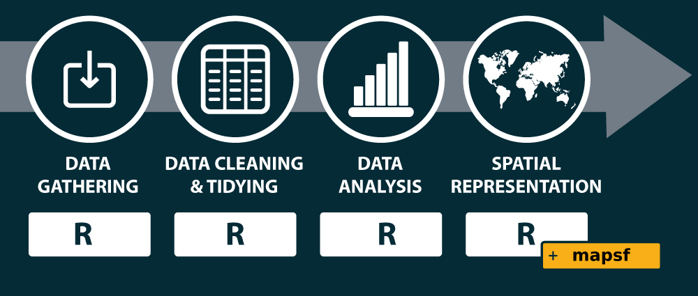
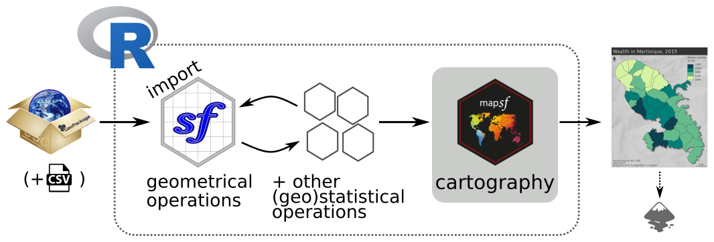
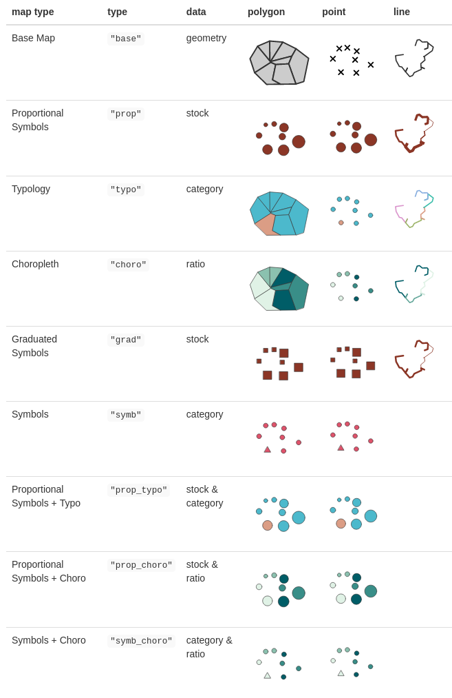
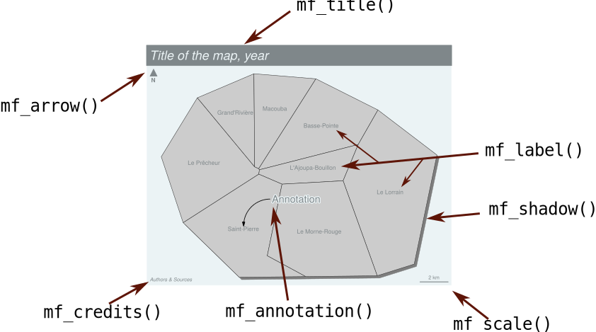
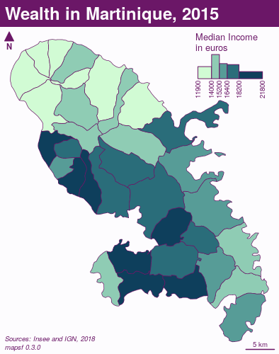
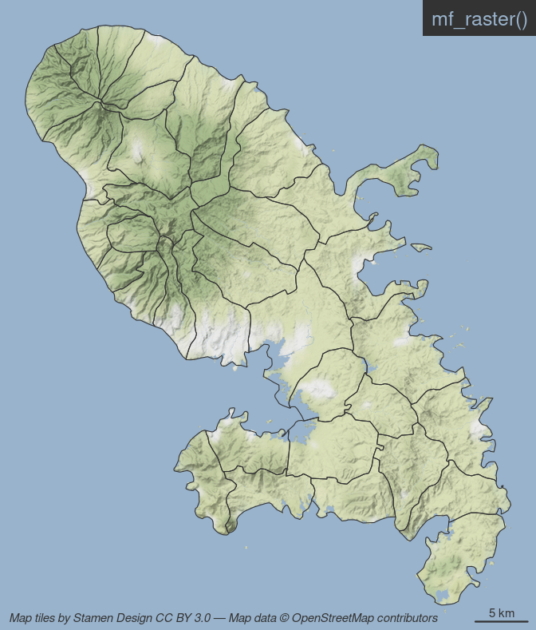
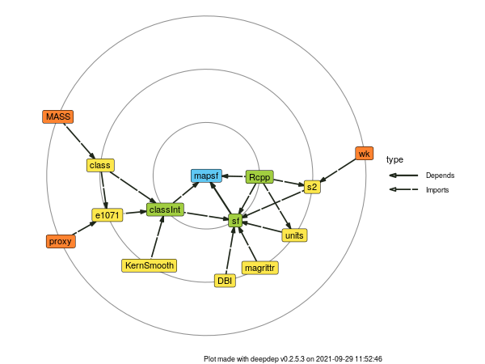
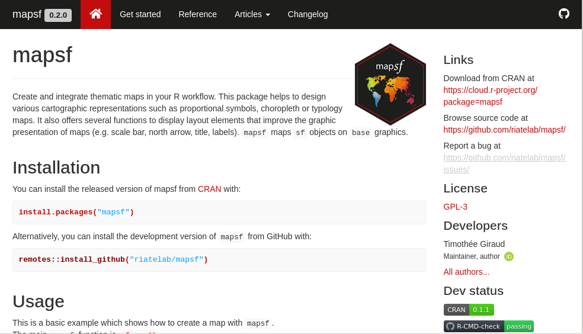

```{r setup, include=FALSE, cache=FALSE}
knitr::opts_chunk$set(
  echo = TRUE, 
  cache=TRUE, 
  fig.width = 8, 
  out.width="80%",
  fig.align="center"
)
```


####  
# La recherche reproductible

### Au coeur de la méthode scientifique

* Les sciences se reposent sur le principe de reproductibilité.

* La reproductibilité est un élément permettant d’évaluer la validité des résultats.


####  
### Le spectre de la reproductibilité

```{r, echo = FALSE, fig.cap="@peng2011reproducible"}
knitr::include_graphics("img/peng-spectrum.jpg")
```

Accompagner les publications scientifiques des jeux de données et codes sources pour permettre aux collègues de reproduire les résultats.


####  
# La cartographie reproductible


```{r, echo = FALSE, out.width="50%"}
knitr::include_graphics("img/maparticle.jpg")
```

Les cartes, comme les autres productions graphiques ou statistiques sont des éléments à parts entières des études scientifiques.


####  

```{r, echo = FALSE}
knitr::include_graphics("img/chain1.png")
```

La plupart des cartes produites dans un contexte académique sont issues de processus complexes.   
Elles sont souvent produites en utilisant une grande variété de logiciels et de formats.


####  


```{r, echo = FALSE}
knitr::include_graphics("img/chain2.png")
```

Cette variété de formats et de logiciels rend difficile la reproduction des cartes.


####  

```{r, echo = FALSE, fig.cap="@giraudlambert"}
knitr::include_graphics("img/giraudlambert.png", dpi=96)
```


####  

```{r, echo = FALSE, out.width="1000px"}

```

Simplifier les chaines de traitement pour couvrir les différentes étapes de la construction cartographique.


####  

# R et son écosystème spatial


```{r, echo = FALSE, out.width="25%"}
knitr::include_graphics("img/Rlogo.png")
```

* R est un langage et un environnement permettant de réaliser des traitements statistiques et de représentations graphiques.

* R est un logiciel libre sous license GNU General Public License.

* R est multiplateforme (GNU/Linux, Windows, OS X…).


### Autour de R

* Un large ecosystème de *packages* créés par les contributeurs.

* RStudio, un environnement de développement intégré.

* Une solution de *literate programming* basée sur le langage Markdown.

* Des logiciels de gestion de version (git).


####  

### `sf`, pierre angulaire de l'écosystème spatial de R

```{r, echo = FALSE, fig.cap="@pebesma"}
knitr::include_graphics("img/sf_deps.png")
```


####  

### `sf`, les fonctionnalités d'un SIG

* Import / Export de données spatiales (vectorielles)
* Affichage
* Gestion des systèmes de coordonnées (les projections)
* Sélections spatiales (*intersects*, *within*, *contains*... )
* Opérations sur les géométries (zone tampon, centroïdes, agrégations, intersections, découpages...)
* Mesures (longueurs, distances, surfaces)


Mais les fonctionnalités cartographiques de `sf` sont limitées. 


####  


# Le package `mapsf`

```{r, echo = FALSE, out.width="100%", fig.cap="Chaîne de traitement typique"}

```

####  


## `mf_map()`

[`mf_map()`](https://riatelab.github.io/mapsf/reference/mf_map.html) est la fonction principale du package.

```r
mf_map(x = objet_sf,
var = "variable",
type = "type de représentation",
...)
```


```{r, echo = FALSE, out.width="100%", fig.cap="?mapsf"}
knitr::include_graphics("img/help.png")
```

####  


## 9 types de carte 

Vignette : [Get started](https://riatelab.github.io/mapsf/articles/mapsf.html#symbology)


```{r, echo = FALSE, out.width="657px"}

```


####  


## Habillage

```{r, echo = FALSE, out.width="80%"}

```


####  


#### 


## Exemple


* Affichage du fond de carte : 

<div class="row">
<div class="col-md-7" markdown="1">
```{r, results='hide', message = FALSE, echo = FALSE}
library(mapsf)
```
```{r ax, eval=FALSE}
mtq <- mf_get_mtq()
# Plot the base map
mf_map(x = mtq)
```
</div>
<div class="col-md-5" markdown="1">
```{r ax, message = FALSE, results='hide', fig.width = 5, fig.height=5, eval=TRUE, echo=FALSE, cache = TRUE}
```
</div>
</div>

* Affichage d'une carte choroplèthe avec les paramètres par défaut : 

<div class="row">
<div class="col-md-7" markdown="1">
```{r a, eval=FALSE,  highlight.output=c(1, 3)}
mtq <- mf_get_mtq()
# Plot a choropleth map
mf_map(x = mtq, var = "MED", type = "choro")
```

</div>
<div class="col-md-5" markdown="1">

```{r a, message = FALSE, results='hide', fig.width = 5, fig.height=5, eval=TRUE, echo=FALSE}
```
</div>
</div>

* Personnalisation des paramètres de la représentation

<div class="row">
<div class="col-md-7" markdown="1">
```{r b, eval=FALSE}
mtq <- mf_get_mtq()
# Plot a choropleth map
mf_map(x = mtq, var = "MED", type = "choro",
       pal = "Dark Mint",
       breaks = "quantile",
       nbreaks = 6,
       leg_title = "Median Income\n(euros)",
       leg_val_rnd = -2,
       leg_pos = "topright")
```
</div>
<div class="col-md-5" markdown="1">
```{r b, message = FALSE, results='hide', fig.width = 5, fig.height=5, eval=TRUE, echo=FALSE}
```
</div>
</div>


* Ajout d'éléments d'habillage

<div class="row">
<div class="col-md-7" markdown="1">
```{r c, eval=FALSE}
mtq <- mf_get_mtq()
# Plot a choropleth map
mf_map(x = mtq, var = "MED", type = "choro",
       pal = "Dark Mint",
       breaks = "quantile",
       nbreaks = 6,
       leg_title = "Median Income\n(euros)",
       leg_val_rnd = -2,
       leg_pos = "topright")
# Plot a layout elements
mf_title("Wealth in Martinique, 2015")
mf_credits("T. Giraud\nSources: INSEE & IGN, 2018")
mf_scale(size = 5)
mf_arrow('topleft')
```
</div>
<div class="col-md-5" markdown="1">
```{r c, message = FALSE, results='hide', fig.width = 5, fig.height=5, eval=TRUE, echo=FALSE}
```
</div>
</div>


* Utilisation d'un thème

<div class="row">
<div class="col-md-7" markdown="1">
```{r d, eval=FALSE}
mtq <- mf_get_mtq()
# Start a map using a theme
mf_init(x = mtq, theme = "dark")
# Plot a choropleth map
mf_map(x = mtq, var = "MED", type = "choro",
       pal = "Dark Mint",
       breaks = "quantile",
       nbreaks = 6,
       leg_title = "Median Income\n(euros)",
       leg_val_rnd = -2,
       leg_pos = "topright",
       add = TRUE)
# Plot a layout elements
mf_title("Wealth in Martinique, 2015")
mf_credits("T. Giraud\nSources: INSEE & IGN, 2018")
mf_scale(size = 5)
mf_arrow('topleft')
```
</div>
<div class="col-md-5" markdown="1">

```{r d, message = FALSE, results='hide', fig.width = 5, fig.height=5, eval=TRUE, echo=FALSE}
```
</div>
</div>


* Ajout d'un ombrage

<div class="row">
<div class="col-md-7" markdown="1">
```{r e, eval=FALSE}
mtq <- mf_get_mtq()
# Start a map using a theme
mf_init(x = mtq, theme = "dark")
# Plot a shadow
mf_shadow(mtq, col = "grey10", add = TRUE)
# Plot a choropleth map
mf_map(x = mtq, var = "MED", type = "choro",
       pal = "Dark Mint",
       breaks = "quantile",
       nbreaks = 6,
       leg_title = "Median Income\n(euros)",
       leg_val_rnd = -2,
       leg_pos = "topright",
       add = TRUE)
# Plot a layout elements
mf_title("Wealth in Martinique, 2015")
mf_credits("T. Giraud\nSources: INSEE & IGN, 2018")
mf_scale(size = 5)
mf_arrow('topleft')
```
</div>
<div class="col-md-5" markdown="1">
```{r e, message = FALSE, results='hide', fig.width = 5, fig.height=5, eval=TRUE, echo=FALSE}
```
</div>
</div>


* Ajout d'un carton de localisation

<div class="row">
<div class="col-md-7" markdown="1">
```{r f, eval=FALSE}
mtq <- mf_get_mtq()
# Start a map using a theme
mf_init(x = mtq, theme = "dark")
# Plot a shadow
mf_shadow(mtq, col = "grey10", add = TRUE)
# Plot a choropleth map
mf_map(x = mtq, var = "MED", type = "choro",
       pal = "Dark Mint",
       breaks = "quantile",
       nbreaks = 6,
       leg_title = "Median Income\n(euros)",
       leg_val_rnd = -2,
       leg_pos = "topright",
       add = TRUE)
# Add an inset world map
mf_inset_on(x = "worldmap", pos = "right")
mf_worldmap(mtq, col = "#0E3F5C")
mf_inset_off()
# Plot a layout elements
mf_title("Wealth in Martinique, 2015")
mf_credits("T. Giraud\nSources: INSEE & IGN, 2018")
mf_scale(size = 5)
mf_arrow('topleft')
```
</div>
<div class="col-md-5" markdown="1">
```{r f, message = FALSE, results='hide', fig.width = 5, fig.height=5, eval=TRUE, echo=FALSE}
```
</div>
</div>


* Extension des marges de la figure sur la droite

<div class="row">
<div class="col-md-7" markdown="1">
```{r g, eval=FALSE}
mtq <- mf_get_mtq()
# Start a map using a theme and extra margins
mf_init(x = mtq, theme = "dark",
        expandBB = c(0,0,0,.3))
# Plot a shadow
mf_shadow(mtq, col = "grey10", add = TRUE)
# Plot a choropleth map
mf_map(x = mtq, var = "MED", type = "choro",
       pal = "Dark Mint",
       breaks = "quantile",
       nbreaks = 6,
       leg_title = "Median Income\n(euros)",
       leg_val_rnd = -2,
       leg_pos = "topright",
       add = TRUE)
# Add an inset world map
mf_inset_on(x = "worldmap", pos = "right")
mf_worldmap(mtq, col = "#0E3F5C")
mf_inset_off()
# Plot a layout elements
mf_title("Wealth in Martinique, 2015")
mf_credits("T. Giraud\nSources: INSEE & IGN, 2018")
mf_scale(size = 5)
mf_arrow('topleft')


```
</div>
<div class="col-md-5" markdown="1">
```{r g, message = FALSE, results='hide', fig.width = 5, fig.height=5, eval=TRUE, echo=FALSE}
```
</div>
</div>


####  


## Création de cartons 


Vignette : [How to Create Inset Maps](https://riatelab.github.io/mapsf/articles/web_only/how_to_create_inset_maps.html) 


```{r set, echo = FALSE, cache=FALSE}
mf_theme("default", mar = c(0,0,0,0), bg = "white")
```


* Avec un objet géographique

<div class="row">
<div class="col-md-5" markdown="1">
```{r carton1, eval = FALSE}
mf_map(mtq)
mf_inset_on(x = mtq[1, ], 
            cex = .3)
mf_map(mtq[1, ])
mf_inset_off()

```
<br><br><br><br><br><br><br><br>
</div>
<div class="col-md-5" markdown="1">
```{r carton1, eval = TRUE, echo = FALSE,  fig.width= 5, fig.height = 6, message = FALSE, results='hide'}
```
</div>
</div>


* Avec une carte de localisation

<div class="row">
<div class="col-md-5" markdown="1">
```{r carton2, eval = FALSE}

mf_map(mtq)
mf_inset_on(x = "worldmap", 
            pos = "bottomleft")
mf_worldmap(x = mtq)
mf_inset_off()
```
<br><br><br><br><br><br><br><br>
</div>
<div class="col-md-5" markdown="1">
```{r carton2, eval = TRUE, echo = FALSE, fig.width= 5, fig.height = 6, message = FALSE, results='hide'}
```

</div>
</div>

* Encart non cartographiques

```{r, echo = FALSE, out.width="394px"}

```


####  


## Thèmes 

Vignette : [How to Use Themes](https://riatelab.github.io/mapsf/articles/web_only/how_to_use_themes.html) 

```{r, message = FALSE, results='hide', echo = FALSE, fig.height=8, fig.width = 7}
par(mfrow = c(3,3))
mf_theme("default")
mf_map(mtq)
mf_title("default")

mf_theme("jsk")
mf_map(mtq)
mf_title("jsk")

mf_theme("green")
mf_map(mtq)
mf_title("green")

mf_theme("darkula")
mf_map(mtq)
mf_title("darkula")

mf_theme("ink")
mf_map(mtq)
mf_title("ink")

mf_theme("candy")
mf_map(mtq)
mf_title("candy")

mf_theme("dark")
mf_map(mtq)
mf_title("dark")

mf_theme("nevermind")
mf_map(mtq)
mf_title("nevermind")

mf_theme(bg = "#aad3df", fg = "#393939", mar = c(0,0,0,0),
         tab = TRUE, inner = TRUE, line = 1.3, pos = "center",
         cex = 1.1, font = 3)
mf_map(mtq)
mf_title("Custom")


```


####  


## Raster 

<div class="row">
<div class="col-md-7" markdown="1">
```{r raster1, message = FALSE, results='hide', eval=FALSE, echo=TRUE}
library(maptiles)
mtq <- st_transform(mtq, 3857)
osm <- get_tiles(
  mtq, 
  provider = "Stamen.TerrainBackground", 
  crop= TRUE, 
  zoom = 11
)
th <- mf_theme(
  x = "default", bg = "#99b3cc", 
  inner = TRUE, line = 1.5, cex = 1, 
  pos = "right", mar = c(0,0,0,0)
)
mf_export(x = osm, filename = "img/osm.png", 
          width = 672, theme = th, res = 150)
mf_raster(osm)
mf_map(mtq, col = NA, add = TRUE)
mf_scale()
mf_title("mf_raster()")
mf_credits(get_credit("Stamen.TerrainBackground"))
dev.off()

```

</div>
<div class="col-md-5" markdown="1">
```{r, echo = FALSE}

```
</div>
</div>


####  


## Nouveau  
<div class="row">
<div class="col-md-7" markdown="1">
```{r bg, eval=FALSE}
library(mapsf)
mtq <- mf_get_mtq()
mf_init(mtq, theme = "default")
mf_background("img/blackboard.jpg")
mf_map(mtq, lwd = 3, col = NA,
       border = "white", add = TRUE)
mf_credits(
  txt = "Photo by Noita Digital on Unsplash",
  col = "white"
)
mf_title("mf_background()")
```

</div>
<div class="col-md-5" markdown="1">
```{r bg, message = FALSE, results='hide', eval=TRUE, echo=FALSE, fig.width= 5, fig.height = 6}
```
</div></div>


####  


## Développement 

Un nombre minimal de dépendances solides.


```{r, echo = FALSE, eval = FALSE, results='hide'}
library(deepdep)
dep <- deepdep("mapsf", depth = 6)
png("img/deps.png", width  = 600, height = 450)
plot_dependencies(dep, "circular", same_level = TRUE, reverse = TRUE, main = 'toto')
dev.off()

```
<center>

</center>


- CI/CD avec les [GitHub Actions](https://github.com/riatelab/mapsf/actions)

- Tests avec le package `tinytest`, couverture avec [Codecov](https://app.codecov.io/gh/riatelab/mapsf)

- Utilisation de la convention de nommage des *commits* [conventional commits](https://www.conventionalcommits.org/en/v1.0.0-beta.3/)


####  


# Merci

[Site web du package](https://riatelab.github.io/mapsf/)

<center>
[](https://riatelab.github.io/mapsf/)
</center>


<div class="row">
<div class="col-md-5" markdown="1">

  [rcarto.github.io/ined2021](https://rcarto.github.io/ined2021)

</div>
<div class="col-md-5" markdown="1">

  [github.com/riatelab/mapsf](https://github.com/riatelab/mapsf)

</div>
</div>


<div class="row">
<div class="col-md-5" markdown="1">

  [\@rgeomatic](http://twitter.com/rgeomatic)

</div>
<div class="col-md-5" markdown="1">

  [rgeomatic.hypotheses.org](https://rgeomatic.hypotheses.org/)

</div>
</div>


## `sessionInfo()`

```{r test, echo=FALSE}
sessionInfo()
```


## References 

